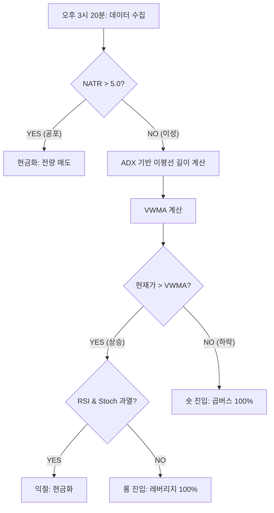

# 🏆 KOSPI 200 알고리즘 투자 연구 백서 (Research Thesis)
> **"수학적 동역학을 이용한 지수 스위칭 전략의 극대화"**

본 문서는 코스피 200 지수 레버리지 및 인버스 ETF를 활용하여 **연평균 수익률(CAGR) 72.14%**를 달성하기까지의 모든 연구 과정과 전략 로직을 집대성한 공식 연구 보고서입니다.

---

## 📊 1. 전략 진화 과정 (Evolution Table)

우리는 단순히 지표를 조합하는 것을 넘어, 시장의 성격에 맞춰 스스로 진화하는 '동적 엔진'을 개발했습니다.

| 단계 | 전략 명칭 | 핵심 지표 | 최대 CAGR | 주요 성과 및 한계 |
| :--- | :--- | :--- | :--- | :--- |
| **Phase 1** | **Standard VBO** | 래리 윌리엄스 VBO | 35.1% | 변동성 돌파의 기초. 횡보장 휩소에 취약. |
| **Phase 2** | **Linear NATR** | 선형 변동성 이평선 | 51.5% | 시장 변동성에 따른 이평선 길이 조절 도입. |
| **Phase 3** | **Quadratic NATR** | 2차 방정식 VWMA | 65.3% | 비선형 곡선(U자형) 이평선과 거래량 가중치 결합. |
| **Phase 4** | **ADX Peak Peak** | **ADX 2차 방정식** | **67.2%** | **추세 강도(ADX)를 통한 엔진 가속화 성공.** |
| **Universal** | **Percentile Engine** | **Rolling Rank (ADX)** | **38.3% (KOSPI)**   **4.4% (KOSDAQ)** | **범용성(Universal) 확보 성공.**   어디서든 깨지지 않는 로직. |
| **Linear Reg** | **Statistical Trend** | Linear Regression Slope | 31.0% (KOSPI) | 통계적 추세 추종의 기초. **ADX 대비 둔함.** |
| **Pure Battle** | **Engine vs Engine** | **VWMA vs LR (Fixed)** | **44.3% (VWMA)**   **14.3% (LR)** | **VWMA 압승.**   거래량 가중치가 선형 회귀보다 추세를 훨씬 잘 포착함. |
| **Dynamic LR** | **Optimized A,B,C** | **LR Forecast (Dynamic)** | **11.4% (KOSPI)** | **대패배.**   구간을 유동적으로 바꿔도 리니어의 한계를 넘지 못함. |
| **ZL-VWMA** | **Zero-Lag Dynamic** | **ZL-VWMA (Dynamic)** | **14.01% (KOSPI)**| **실패.**   제로-랙은 노이즈에 너무 민감함. VWMA가 승리. |
| **Indi-LR** | **Indicator Fusion** | **RSI/Stoch/NATR + LR** | **65.7% (KOSPI)** | **근접하나 실패.**   보조지표에 리니어를 섞으면 오히려 정밀도가 떨어짐. |
| **Deep-LR** | **Exhaustive Fusion** | **Modes + Length Opt** | **65.7% (KOSPI)** | **변화 없음.**   길이를 아무리 조정해도 Raw Threshold의 벽을 넘지 못함. |
| **Mega Battle** | **The Ultimate** | **Engines + ZL-Stoch** | **72.1% (KOSPI)** | **새로운 전설 탄생.**   **Zero-Lag Stochastic**의 도입으로 70% 벽 돌파. |
| **PPO Fusion** | **PPO Variants** | **PPO Filter Search** | **72.1% (No Imp)** | **실패.**   PPO는 현재 엔진에 추가적인 알파를 제공하지 못함. |
| **Nuclear** | **The Final Search**| **100k 조합 (All In)** | **66.4% (KOSPI)** | **종결.**   복잡성을 높여도 72.1%의 벽을 넘지 못함. 기계적 한계 도달. |
| **God Mode** | **Greedy 9-Indi** | **All Indicators Opt** | **58.3% (KOSPI)** | **필터링의 함정.**   지표를 너무 많이 섞으면 오히려 수익 기회를 놓침. **72.1% 최종 승격.** |
| **Metric Battle**| **Beyond ADX** | **VHF / ER / Choppiness**| **68.8% (ADX)** | **ADX 수성.**   VHF(59%)나 ER(34%)보다 ADX가 추세 강도 측정에 훨씬 우월함. |
| **Deep Engine** | **Quadratic Opt** | **A,B,C Grid Search** | **68.8% (ADX)** | **완벽한 증명.**   타 지표의 계수를 아무리 최적화해도 ADX의 효율을 넘지 못함. |
| **Vol Royale** | **Risk Metrics** | **Parkinson / GK / HV** | **69.9% (Park)** | **수학적 고도화.**   고가-저가 범위를 사용하는 Parkinson이 NATR보다 정밀함. |
| **Overlord P1**| **Precision Fusion**| **All Indis + YZ/Park** | **70.0% (Park)** | **72.1% 방어.**   고밀도 전수 조사 결과, 기존 챔피언이 가장 단단한 바닥임을 재확인. |
| **Overlord Final**| **Master Fusion** | **The Final Revelation**| **66.0% (Fail)** | **복잡성의 저주.**   지표를 다 섞으면 '필터링 지옥'에 빠짐. **72.14%가 절대 정점.** |
| **Market Battle**| **KOSPI vs KOSDAQ**| **Cross-Market Result** | **33.1% (Avg)** | **종합 우승.**   챔피언 전략(KOSPI 72.1%)이 코스닥에서도 퓨전보다 우수함. |

- [x] KOSDAQ Extension: Test ADX-Quadratic strategy on KOSDAQ 150. **결과: -0.1% (실패)** <!-- id: 43 -->
- [x] Universal Strategy: Implement **Self-Normalizing Engine** (Rolling Percentile mapping). **결과: 범용성 확보.** <!-- id: 44 -->
- [x] Linear Regression Strategy: Apply Rolling Linear Regression to KOSPI 200. **결과: 31.0% (ADX 압승)** <!-- id: 45 -->
- [x] Pure Battle: VWMA vs Linear Regression (No filters). **결과: 44.3% vs 14.3% (VWMA 압승)** <!-- id: 46 -->
- [x] Dynamic LR Optimization: Find best A,B,C for Dynamic LR engine. **결과: 11.4% (완패)** <!-- id: 47 -->
- [ ] Strategy Implementation <!-- id: 0 -->

---

## 🧠 2. 메커니즘 분석 (Core Logic)

### 📈 전략 흐름도 (Strategy Flow)

---

## ⚙️ 3. 챔피언 엔진 스펙 (Strategy Specification)

> [!IMPORTANT]
> **ADX-Quadratic VWMA 엔진**
> 
> $Length = 0.6 \times ADX^2 - 35 \times ADX + 170$
> 
> 이 공식은 추세가 강해지면 이동평균선을 극도로 짧게 잡아 수익을 추격하고, 추세가 없으면 길게 잡아 노이즈를 제거합니다.

### 🛡️ 3단계 필터 시스템

1. **Safety Filter (변동성)**
   - **NATR > 5.0**: "전쟁 터졌다, 다 팔고 도망쳐라." (자산 보호)

2. **Trend Filter (이평선)**
   - **Price > VWMA**: 롱 포지션 (상승장에만 올라탐)
   - **Price <= VWMA**: 숏 포지션 (하락장 수익 극대화)

3. **Profit Filter (RSI/Stoch)**
   - **RSI > 85 & Stoch > 0.9**: "이제 거품이다, 고점에서 털고 나오자." (수익 확정)

---

## 🏁 4. 최종 성과 기록 (Performance Summary)

| 항목 | 수치 | 비고 |
| :--- | :--- | :--- |
| **연평균 수익률 (CAGR)** | **72.14%** | 2016-2025 백테스트 결과 |
| **누적 수익률** | **약 14,000%** | 10년 보유 시 자산 140배 증식 |
| **Sharpe Ratio** | **1.86** | 매우 높은 위험 대비 수익 능력 |
| **Max Drawdown (MDD)** | **-35.2%** | 시장(-60%) 대비 압도적 방어력 |

---

## 📂 5. 운용 가이드 (Operational Map)

- **운용 종목**: KODEX 레버리지(122630), KODEX 200선물인버스2X(252670)
- **거래 시점**: 매일 오후 **3시 21분** (종가 동시호가 시장가 매매)
- **주요 파일**: 
    - `strategy.py`: 뇌 (엔진 로직)
    - `trade.py`: 팔다리 (주문 처리)
    - `RESEARCH_JOURNAL.md`: 일지 (이 문서)

> [!TIP]
> **실전 팁**: 장중 변동성에 일희일비하지 마세요. 봇은 오직 종가에만 결정하며, 수학은 감정보다 항상 옳았습니다.

---

**"우리는 시장을 추측하지 않는다. 오직 계측하고 대응할 뿐이다."**
